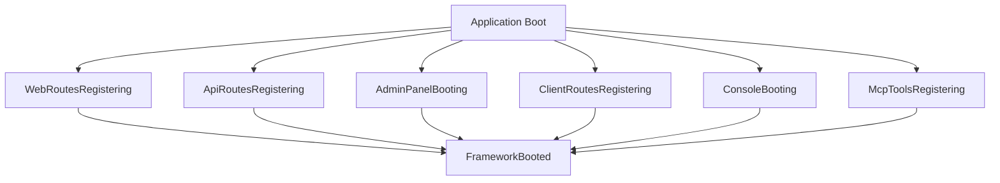

# Lifecycle Events

Core PHP Framework uses lifecycle events to coordinate module loading and system initialization. This event-driven architecture enables lazy loading and keeps modules decoupled.

## Event Flow



## Core Events

### WebRoutesRegistering

Fired when public web routes are being registered.

```php
<?php

namespace Mod\Blog;

use Core\Events\WebRoutesRegistering;

class Boot
{
    public static array $listens = [
        WebRoutesRegistering::class => 'onWebRoutes',
    ];

    public function onWebRoutes(WebRoutesRegistering $event): void
    {
        $event->views('blog', __DIR__.'/Views');
        $event->translations('blog', __DIR__.'/Lang');

        $event->routes(function () {
            require __DIR__.'/Routes/web.php';
        });
    }
}
```

**Available Methods:**
- `views(string $namespace, string $path)` - Register view namespace
- `translations(string $namespace, string $path)` - Register translations
- `routes(Closure $callback)` - Register routes
- `middleware(array $middleware)` - Add global middleware

### ApiRoutesRegistering

Fired when API routes are being registered.

```php
public function onApiRoutes(ApiRoutesRegistering $event): void
{
    $event->routes(function () {
        Route::middleware(['auth:sanctum', 'scope:posts:read'])
            ->get('/posts', [PostApiController::class, 'index']);
    });
}
```

**Available Methods:**
- `routes(Closure $callback)` - Register API routes
- `middleware(array $middleware)` - Add API middleware
- `prefix(string $prefix)` - Set route prefix
- `version(string $version)` - Set API version

### AdminPanelBooting

Fired when admin panel is initializing.

```php
use Core\Events\AdminPanelBooting;
use Core\Front\Admin\Contracts\AdminMenuProvider;

public function onAdminPanel(AdminPanelBooting $event): void
{
    $event->menu(new BlogMenuProvider());
    $event->views('blog-admin', __DIR__.'/Views/Admin');
    $event->livewire('blog', __DIR__.'/Livewire');
}
```

**Available Methods:**
- `menu(AdminMenuProvider $provider)` - Register menu provider
- `views(string $namespace, string $path)` - Register admin views
- `livewire(string $namespace, string $path)` - Register Livewire components
- `assets(string $path)` - Register frontend assets

### ClientRoutesRegistering

Fired when authenticated client routes are being registered.

```php
use Core\Events\ClientRoutesRegistering;

public function onClientRoutes(ClientRoutesRegistering $event): void
{
    $event->routes(function () {
        Route::middleware(['auth', 'verified'])
            ->group(function () {
                Route::get('/dashboard', [DashboardController::class, 'index']);
            });
    });
}
```

### ConsoleBooting

Fired when Artisan console is initializing.

```php
use Core\Events\ConsoleBooting;

public function onConsole(ConsoleBooting $event): void
{
    $event->commands([
        PublishPostsCommand::class,
        GenerateSitemapCommand::class,
    ]);

    $event->schedule(function ($schedule) {
        $schedule->command('posts:publish')
            ->hourly()
            ->withoutOverlapping();
    });
}
```

**Available Methods:**
- `commands(array $commands)` - Register Artisan commands
- `schedule(Closure $callback)` - Define scheduled tasks

### McpToolsRegistering

Fired when MCP (Model Context Protocol) tools are being registered.

```php
use Core\Events\McpToolsRegistering;
use Mod\Blog\Mcp\BlogTools;

public function onMcpTools(McpToolsRegistering $event): void
{
    $event->tool(new BlogTools());
}
```

**Available Methods:**
- `tool(object $tool)` - Register MCP tool
- `resource(string $type, Closure $callback)` - Register resource provider
- `prompt(string $name, Closure $callback)` - Register prompt template

### FrameworkBooted

Fired after all modules have loaded. Use for late initialization.

```php
use Core\Events\FrameworkBooted;

public function onFrameworkBooted(FrameworkBooted $event): void
{
    // Run after all modules loaded
    $this->registerPolicies();
    $this->publishAssets();
}
```

## Custom Events

Create custom lifecycle events by extending `LifecycleEvent`:

```php
<?php

namespace Mod\Shop\Events;

use Core\Events\LifecycleEvent;
use Core\Events\Concerns\HasEventVersion;

class PaymentGatewaysRegistering extends LifecycleEvent
{
    use HasEventVersion;

    protected array $gateways = [];

    public function gateway(string $name, string $class): void
    {
        $this->gateways[$name] = $class;
    }

    public function getGateways(): array
    {
        return $this->gateways;
    }

    public function version(): string
    {
        return '1.0.0';
    }
}
```

**Usage in Module:**

```php
use Mod\Shop\Events\PaymentGatewaysRegistering;

class Boot
{
    public static array $listens = [
        PaymentGatewaysRegistering::class => 'onPaymentGateways',
    ];

    public function onPaymentGateways(PaymentGatewaysRegistering $event): void
    {
        $event->gateway('stripe', StripeGateway::class);
        $event->gateway('paypal', PayPalGateway::class);
    }
}
```

## Event Versioning

Events can declare versions for backward compatibility:

```php
use Core\Events\Concerns\HasEventVersion;

class MyEvent extends LifecycleEvent
{
    use HasEventVersion;

    public function version(): string
    {
        return '2.1.0';
    }
}
```

**Version Checking:**

```php
if (version_compare($event->version(), '2.0.0', '>=')) {
    // Use v2 features
} else {
    // Fallback for v1
}
```

## Lazy Loading

Modules only instantiate when their events fire:

```php
// ModuleRegistry registers lazy listeners
Event::listen(WebRoutesRegistering::class, function ($event) {
    // Module instantiated only when event fires
    $module = new \Mod\Blog\Boot();
    $module->onWebRoutes($event);
});
```

**Benefits:**
- Faster boot times
- Lower memory usage
- Load only what's needed
- No unused module overhead

## Event Profiling

Profile listener execution in development:

```php
use Core\Events\ListenerProfiler;

// config/app.php
'providers' => [
    // ...
    ListenerProfiler::class, // Only in development
],
```

**Output:**

```
Lifecycle Event Performance:
- WebRoutesRegistering: 45ms (12 listeners)
- ApiRoutesRegistering: 23ms (8 listeners)
- AdminPanelBooting: 67ms (15 listeners)
```

## Best Practices

### 1. Keep Listeners Fast

```php
// ✅ Good - quick registration
public function onWebRoutes(WebRoutesRegistering $event): void
{
    $event->routes(fn () => require __DIR__.'/Routes/web.php');
}

// ❌ Bad - heavy processing
public function onWebRoutes(WebRoutesRegistering $event): void
{
    // Don't do expensive operations here!
    $this->generateSitemap();
    $this->warmCache();
}
```

### 2. Use Appropriate Events

```php
// ✅ Good - right event for the job
WebRoutesRegistering::class => 'onWebRoutes',
ConsoleBooting::class => 'onConsole',

// ❌ Bad - wrong event
WebRoutesRegistering::class => 'registerCommands', // Use ConsoleBooting!
```

### 3. Defer Heavy Work

```php
public function onFrameworkBooted(FrameworkBooted $event): void
{
    // ✅ Good - queue heavy work
    dispatch(new BuildSearchIndex());

    // ❌ Bad - blocking
    $this->buildSearchIndex(); // Takes 5 seconds!
}
```

### 4. Handle Missing Dependencies

```php
public function onAdminPanel(AdminPanelBooting $event): void
{
    if (!class_exists(Livewire::class)) {
        Log::warning('Livewire not installed, skipping components');
        return;
    }

    $event->livewire('blog', __DIR__.'/Livewire');
}
```

## Testing Events

```php
use Tests\TestCase;
use Core\Events\WebRoutesRegistering;

class BlogBootTest extends TestCase
{
    public function test_registers_routes(): void
    {
        $event = new WebRoutesRegistering();

        $boot = new \Mod\Blog\Boot();
        $boot->onWebRoutes($event);

        $this->assertTrue(Route::has('blog.index'));
    }

    public function test_registers_views(): void
    {
        $event = new WebRoutesRegistering();
        $boot = new \Mod\Blog\Boot();
        $boot->onWebRoutes($event);

        $this->assertTrue(
            View::getFinder()->getHints()['blog'] ?? false
        );
    }
}
```

## Debugging Events

Enable event logging:

```php
// config/logging.php
'channels' => [
    'lifecycle' => [
        'driver' => 'single',
        'path' => storage_path('logs/lifecycle.log'),
        'level' => 'debug',
    ],
],
```

**Log Output:**

```
[2026-01-26 12:00:00] Firing: WebRoutesRegistering
[2026-01-26 12:00:00] Listener: Mod\Blog\Boot@onWebRoutes (12ms)
[2026-01-26 12:00:00] Listener: Mod\Shop\Boot@onWebRoutes (8ms)
```

## Learn More

- [Module System →](/core/modules)
- [Actions Pattern →](/core/actions)
- [Multi-Tenancy →](/core/tenancy)
